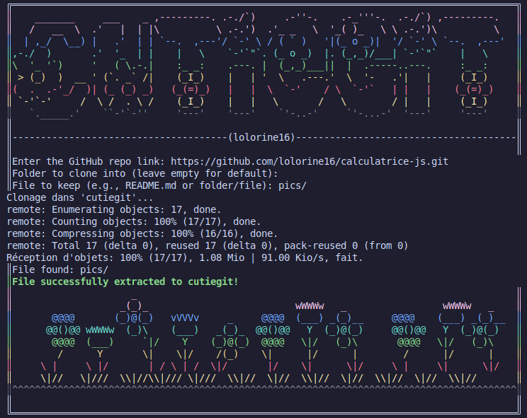

# CutieGit 🌷

A splash of color in your terminal life! 💕



### 🍵 Why CutieGit?

Because sometimes you're just too lazy to manually delete the entire repo after extracting only one or two files.  
I'm sure you already have a million Git or file management aliases to simplify your navigation ~ but trust me, all you need now is to type `cutieGit` and **BOOM SHAKALAKA!**, you're done 😆✨

**It's made for lazy folks, and it's made to be cute 💕**

### ✨ Features

CutieGit isn't just a pretty name — it's here to make your life easier 😉:

-  **Save space**: After extracting what you want, the cloned repo is deleted automatically — you don’t have to worry about cleanup. 🌸
-  **Easy to find**: You choose where your files go. If you don’t specify, CutieGit will place them neatly in a `cutieGit/` folder.💫
-  **One command**: Just move `cutieGit.sh` to your `/bin` or `/usr/local/bin`, and then use it with a simple `cutieGit` + [enter].🌸

### 🍡 How does it work?

1. **Clone this repo (yes, just one last time using `git clone` 😭)**

   ```bash
   git clone https://github.com/lolorine16/cutieGit.git
   ```

2. **Move the main script to your system path (*for example: /usr/local/bin/*)**

    ``` bash
    sudo cp cutieGit.sh /usr/local/bin/cutieGit
    chmod +x /usr/local/bin/cutieGit
    ```

  3. **Now you're ready! Just run:** `cutieGit`


   4. **Follow the prompts:**

   - 🌱Select the file or folder you want to keep

   - 🌱Choose a destination path (or let it default to cutieGit/)

   - 🌱Done! 
   
### 😭 Upcoming Features

- [x] **ASCII Logo** - Create a small CUTIE GIT logo and flower footer
- [ ] Graphical file selector (**gum**)
- [ ] Pretty progress bars and feedback
- [ ] Archive option (zip what you extract)
- [ ] Add a cutieGit.sh --help mode
- [ ] Choose your color palette 

---

```
  /\_/\  
(  o.o  )  Meow! ✨ Stay lazy. Stay cute. Use CutieGit. 
  > ^ <
```

---
